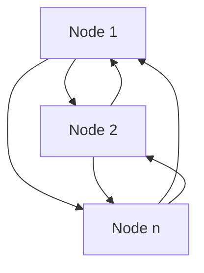
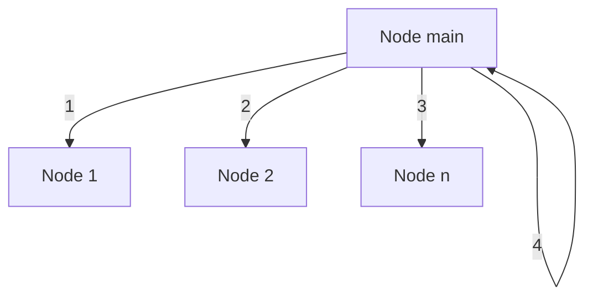

# Cluster
Autor: Eder Leandro Carbonero Baquero

## Content

 - [Project target](#Project-target)
 - [Parallelism project](#Parallelism-project)
 - [Parallelism exercises](#Parallelism-exercises)
 - [Targets](#Targets)
 - [Getting started](#Getting-started)

## Project target
The objective of the project is to demonstrate that it is possible to create a group of interconnected clusters that allow distribution of tasks during the execution of a program.

## Parallelism project 

### Content parallelism project

 - Cluster capabilities
 - Distribution
 - Node distribution
 - Node name
 - Module details
 - Beanchmark

### Cluster capabilities

The following list are the capabilities that are implemented in this project and also comprise a deployable application in elixir either on a computer with a desktop or server operating system or an elixir cluster for raspberry pi 3 or 4.

 * **Auto identification of network** ip in ipv4. Ethernet, wifi, usb, internet.

 * **Distribution of memory**. This allow to send information to the each node connected and save it in his local memory to make operation after

 * **Autoconnecto to the reference node**. This allow to set a reference node before to compile and burn the firmware, this allow the each node go in at the cluster network without execute any manual command, please replace the reference node in the following line  `_ = Node.connect(:"nerves@#{"192.168.0.6"}")` (**:"node_reference_name@#{"node_reference_ip"}**)at the module [NodeCluster](lib/cluster/node_cluster.ex)

 * **Data management**. In this part we have a group of modules that manage the information of the raspberry pi in one of its volumes, in this case the main volume ("/root"), the files that have been created in the "./priv" folder as well will be copied to this volume and will be available for execution, this process will be executed every time you start the application

### Distribution

#### Node connection
Elixir and erlang provides and interfaces that allow you connect every node with every node that are present in the same network and has the **cookie value**

Example of connection

A[Node 1: - :"nerves@192.168.0.15"] 
B[Node 2: - :"nerves1@192.168.0.16"]
N[Node n: - :"nerves2@192.168.0.17"]



### Node distribution
In the [TaskCall](lib/cluster/task_call.ex) module you will find a group of functions that allow you to assign tasks through higher order functions, you will have to pass the module, the function (atom-shaped name) and the arguments in a list, or the function and arguments in a list.
If you do not indicate the node where the function should run, the system by default will assign it to one of the available nodes, in this case to the first, if the function is called again it will assign the task to the next available node and so on until assigning tasks to all the connected nodes, once finished it will make the assignment to the first node in the list.

The last node in the list is always the local node, that is, the same one. If it does not have more nodes connected, it will always perform the local assignment.

Example
``` elixir
iex> Cluster.TaskCall.run_sync_auto_detect(String, :duplicate, ["This is a test. ", 3])

"This is a test. This is a test. This is a test. "
```

**Distrubution of task diagram** 

As I mentioned you the distribution is one by one in each node in the network and the last one is gonna be the root node from where is making the distribution



### Node name

This is an important point because without this you network it will no possible, the system by default is going to identify the device ip and also the name, for the raspberry pi the name is gonna be the name of the device, for the host is gonna be 'nerves'. 
If you want to start differentes nodes in you local computer before to compile your code, you have to change the name of your local host in the following line. `:"nerves@#{postfix}"` at the module [node_cluster.ex](lib/cluster/node_cluster.ex), replace 'nervces' by the name you want to use. `:"new_name@#{postfix}"`

``` elixir
 def get_name_node(postfix) do
  if target() == :host do
    :"nerves@#{postfix}"
  else
    :"#{Toolshed.hostname()}@#{postfix}"
  end
end
``` 

The name is an atom with the following parts
1. name of node, this should be unit in the network
2. at symbol '@' is a separator
3. dns or ip where your device or host connects to the network

Example
:"nerves@192.168.0.15"

### Beanchmark 

This part is simple, the goal is to obtain an average time related to the execution time of a task, ten times.

How execute?
``` elixir
Benchmark.Performance.average_mili Module, :function, [args]
``` 

### Module details

 This part of the project contains every necesary things to connect an execute code in a group of cluster

  We are going to push focus on the folder /lib/cluster instance contains a group of code files specialicing to manage de cluster, next to you will see some details of each file

  [application](lib/cluster/application.ex) 

  This provides a initial interface to create an application into the nerves, here we handle some supervice process that are necesaries to provide the features and funcionalities in every cluster, and in configured on mix.exs like application to create a instance of this when we start the node. 


  [Load balancer](lib/cluster/load_balancer.ex)
  This group of functions provides the functionality to asigne the node where the code it will run.
  
  [Node Cluster](lib/cluster/node_cluster.ex) 
   
  This provides and interfaces to handle the network when start the node, that is execute when the node starts, and it will try to connect with a node refence to be into the network


  [Variable](lib/cluster/variable.ex)

  This module allow a cluster to save data in others cluster connected to him, and also connect it locally. Then the user or code can call the function to recover the data and made operations

  [TaskCall](lib/cluster/task_call.ex)
  This module provides a set of interfaces for executing higher-order functions while allowing execution to be distributed across each cluster of nodes connected to the node using these interfaces.


## Parallelism exercises

In this part of the readme we are going to show some details about the exercises and how to run everyone.

All the exercises use the same strategy, sending all the data we need to carry out a process to each node, then we develop the algorithm in such a way that we only send the reading reference parameters so that each node can locally consult the information to carry out its process. and subsequently returns the result only with respect to the indicated parameters, in the manager node or from where the task was launched, the information is ordered and written or displayed as necessary, in the case of images, the pixel map is constructed that later allows you to write and generate a new image.

### Task index

- [Task 1](#Task-1)
- [Task 2](#Task-2)
- [Task 3](#Task-3)

### Task 1
Count of works

This module allow to count a group of words and return a map with the differents words and how many has each one.

- Example simple execution
``` elixir
## Text to evaluate
iex> text = "This\tis\na test Test 1230 They're They it's the it they're"
iex> Exercises.Task1.count text
#output
%{
  "1230" => 1,
  "a" => 1,
  "is" => 1,
  "it" => 1,
  "it's" => 1,
  "test" => 2,
  "the" => 1,
  "they" => 1,
  "they're" => 2,
  "this" => 1
}
``` 

- Example two execute with many words

``` elixir
## Text to evaluate
iex> text = String.duplicate("This\tis\na test Test 1230 They're They it's the it they're", 20000)

iex> Exercises.Task1.count text
#output
%{
  "1230" => 20000,
  "a" => 20000,
  "is" => 20000,
  "it" => 20000,
  "it's" => 20000,
  "test" => 40000,
  "the" => 20000,
  "they" => 20000,
  "they're" => 20001,
  "they'rethis" => 19999,
  "this" => 1
}
``` 

- Example throught beanchmark

``` elixir
## Text to evaluate
iex> text = String.duplicate("This\tis\na test Test 1230 They're They it's the it they're", 20000)

iex> Benchmark.Performance.average_mili(Exercises.Task1, :count, [text])
#output
# average details of each execution
# and finaly the summary
#...
Attemp number: 10
Number of words 220001
%{
  "1230" => 20000,
  "a" => 20000,
  "is" => 20000,
  "it" => 20000,
  "it's" => 20000,
  "test" => 40000,
  "the" => 20000,
  "they" => 20000,
  "they're" => 20001,
  "they'rethis" => 19999,
  "this" => 1
}
Time of execution in miliseconds: 115


RESULTS:
Number of attemps: 10
Average time of execution: 117.7
{:ok}
``` 

### Task 2
Image rotation, the idea is to rotate an image between 0 and 360 degrees.
As was requered it is present three methods, read, rotate and write

**read**
The method read loads the image as a process that allow to arrive to the memory where is saved the image and made specific operations. The name of the image should start with a capital letter and it the name of the process

**rotate** 
Receive the image name reference, and angle to rotate the image

**write**
This receives the path and the image (%Imagineer.Image.PNG{}) to save it

**How to test it?**
- Example one
``` elixir
# folder where is the origin image
iex> origin_image = "./priv/source_images/aqua.png"
# folder where is going to be write the new image
iex> destination_image = "./priv/output_images/aqua.png"
# load the image to every node connected with the default name MyImage
iex> img = Exercises.Task2.read(origin_image)
# Angle to rotate the image
iex> angle = 30
# Rotate the image
iex> new_image = Exercises.Task2.rotate(img, angle)
# write the image in the destation folder
iex> Exercises.Task2.write_image(new_image, destination_image)
``` 

- Example two

In this example we have an exercise ready to run on the computer or raspberry pi, identifying the relative folder with the files, and if you want you can pass the angle of the output image.

``` elixir
iex> Exercises.Task2.test_flow(45)
``` 

- Beanchmark

Execute the benchmark using the next sentence, if you want you you can change the angle changing the value into the brackets

``` elixir
iex> Benchmark.Performance.average_mili Exercises.Task2, :test_flow, [62]
#...
RESULTS:
Number of attemps: 10
Average time of execution: 474.3
{:ok}
``` 

- Result to execute one time the rotation with 67 degrees of angle.

0 degrees


67 degrees


### Task 3


**Read**
The method read loads the image as a process that allow to arrive to the memory where is saved the image and made specific operations. The name of the image should start with a capital letter and it the name of the process

**beier_neely** 
Receive the references of image one and image two

**Write**
This receives the path_folder and list of images (%Imagineer.Image.PNG{}) to save it

**How to test it?**
- Manual execution
``` elixir
# identify if is in a host or a raspberry
iex>  root_folder = if Exercises.Task3.target() == :host, do: :code.priv_dir(:cluster), else: "/root/priv"
# load the image one in all nodes connected
# Image1 is the name of the process that contains the image in memory
# img1 save the reference name in this case Image1
iex> img1 = Exercises.Task3.read("#{root_folder}/source_images/P1.png", Image1)
# load the image one in all nodes connected
# Image2 is the name of the process that contains the image in memory
# img2 save the reference name in this case Image2
iex> img2 = Exercises.Task3.read("#{root_folder}/source_images/P2.png", Image2)
# Folder destination where is gona write the output images 
iex> destination_folder = "#{root_folder}/output_images"
# number of frames in which the transition from image1 to image 2 is represented
iex> numMorphedFrames = 10
# Apply the algorithm beier neely, this receive a list of images
iex> image_list = Exercises.Task3.beier_neely(img1, img2, numMorphedFrames)
# This write all image into the destination folder an set the name
iex> Exercises.Task3.write_images(image_list, destination_folder)
``` 

- Benchmark

To execute this benchmark we have prepare a class that allow us to execute a little bit quickly, in this is not necesary to make a transition of 10 frames, we only will execute it with a couple of this

``` elixir
iex> number_of_frames = 1
iex> Benchmark.Performance.average_mili(Exercises.Task3, :test, [number_of_frames])
## Output
#...
Number of chucks: 23
Number of chucks: 23
Saving images 0
Saving images 1
Time of execution in miliseconds: 9879


RESULTS:
Number of attemps: 10
Average time of execution: 10183.2
{:ok}
iex(nerves@192.168.0.6)102> 
``` 
- Image output

        


## Targets

Nerves applications produce images for hardware targets based on the
`MIX_TARGET` environment variable. If `MIX_TARGET` is unset, `mix` builds an
image that runs on the host (e.g., your laptop). This is useful for executing
logic tests, running utilities, and debugging. Other targets are represented by
a short name like `rpi4` that maps to a Nerves system image for that platform.
All of this logic is in the generated `mix.exs` and may be customized. For more
information about targets see:

https://hexdocs.pm/nerves/targets.html#content

## Getting Started

Clone this repository in your local machine, you can run and test the code that is present in this project

### Local instalation
To start your Nerves app:

* Clean dependencies `mix deps.clean --all`
* Install dependencies with `mix deps.get`
* Then you application is ready to test the modules
  * To connect to other nodes execute `Node.connect(:"name_node@dns_node")`


### Raspberry pi instalation
To start your Nerves app:
  * `export MIX_TARGET=my_target` or prefix every command with
    `MIX_TARGET=my_target`. For example, `MIX_TARGET=rpi4`
  * Clean dependencies `mix deps.clean --all`
  * Install dependencies with `mix deps.get`
  * Create firmware with `mix firmware`
  * Burn to an SD card with `mix burn`
  * Insert your SD card in your raspberry 
  * Then you application is ready to test the modules
  * To connect to other nodes execute `Node.connect(:"name_node@dns_node")`

## Learn more

  * Official docs: https://hexdocs.pm/nerves/getting-started.html
  * Official website: https://nerves-project.org/
  * Forum: https://elixirforum.com/c/nerves-forum
  * Discussion Slack elixir-lang #nerves ([Invite](https://elixir-slackin.herokuapp.com/))
  * Source: https://github.com/nerves-project/nerves
